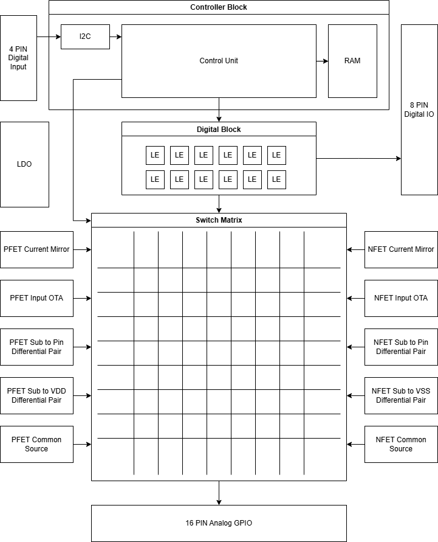
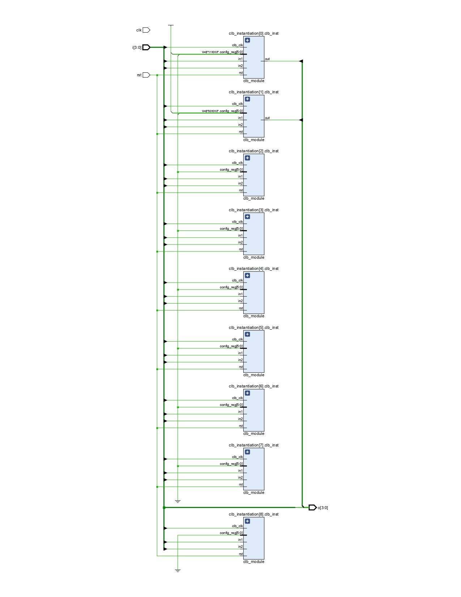
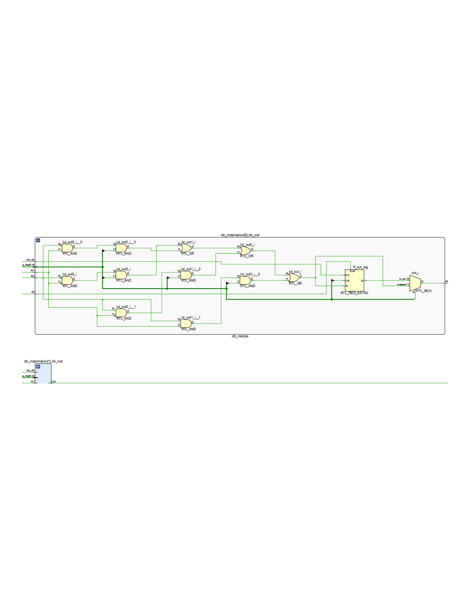
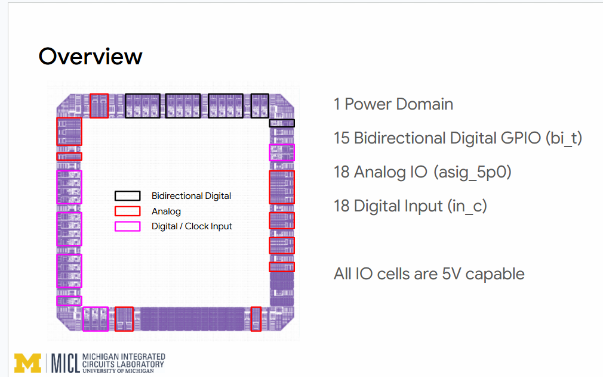
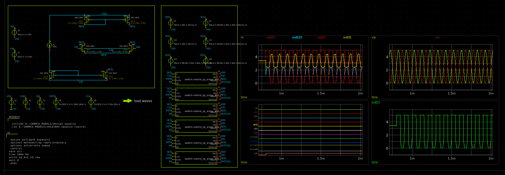
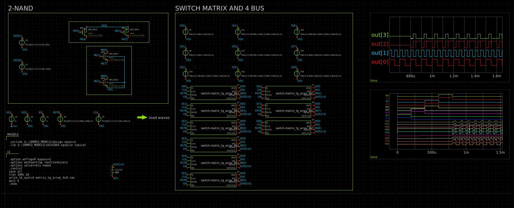
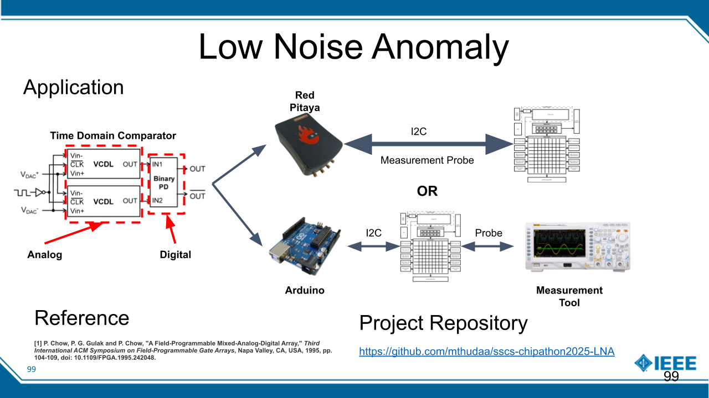
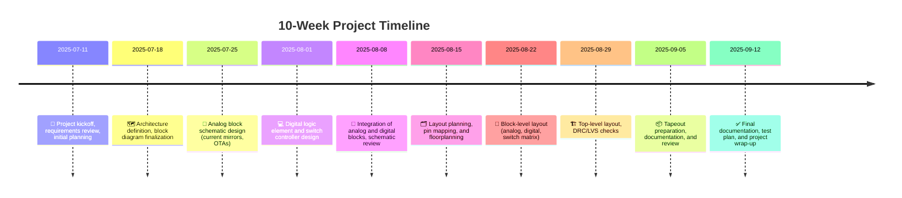

   

# A Mixed-Signal MOSbius Architecture for Emulating Analog and Digital Blocks: The Field Programmable Mixed-Signal Array (FPMA)

## SSCS Chipathon 2025 - MOSbius Track LNA (Low Noise Anomaly) Team Proposal

This repository contains the design proposal for the Chipathon 2025 MOSbius track. MOSbius is an innovative approach for transistor-level learning and direct simulation from schematic designs. Our primary design goal is to integrate both analog and digital circuits onto a single chip to facilitate learning and direct measurement.

A key challenge is connecting the transistor-level analog design with the digital design. To address this, we have included numerous individual FETs, providing significant flexibility for various analog circuit configurations. This flexibility in analog design is complemented by its potential for combination with simple, integrated digital logic elements.

Our design will propose several sub-circuit :

- PMOS Current Mirror (2x, 4x, 8x, 16x)
- NMOS Current Mirror (2x, 4x, 8x, 16x)
- 2x PMOS Differential Pair Body Connected to VDD
- 2x PMOS Differential Pair Body Connected to Pin
- 4x PMOS Common-Source (1x PMOS M=1 Strength and 3x PMOS M=4 Strength)
- 2x NMOS Differential Pair Body Connected to VSS
- 2x NMOS Differential Pair Body Connected to Pin
- 4x NMOS Common-Source (1x NMOS M=1 Strength and 3x NMOS M=4 Strength)
- 1x PMOS-input OTA
- 1x NMOS-input OTA
- 9x Digital Logic Element Block Emulation
---

## Project Overview and Block Diagram
The Field Programmable Mixed-Signal Array (FPMA) design consists of three main blocks: the Analog Block, the Logic Element Block, and the Switch Controller Block. Both the Analog and Logic Element blocks are connected to buses.

**A special module in this project is the tinyFPGA. Why integrate the FPGA on the same die as the chip? The answer is to simplify setup and programming. If the FPGA were attached separately from MOSbius, it would increase complexity and require different (and often large) software tools, making the process less straightforward.**

With this approach, the Mixed-Signal MOSbius can be programmed using a Python-based workflow. Python code generates a hex file, which can then be uploaded via the I2C connection to the Mixed-Signal MOSbius. This hex file encapsulates both the digital and analog design configurations.

**Our team is open to collaboration with other teams on this project! ^_^**

The Analog Block contains numerous individual PFETs and NFETs to provide high flexibility for creating unique schematics. The Logic Element Block is designed as a simple, FPGA-like architecture, enabling the emulation of digital designs alongside analog circuits within the same schematic. **All modules will be connected with a 16 Bus × 70 Pin Switch Matrix**.  
Here is the block diagram:  

## TinyFPGA Diagram

Here, the architecture of tinyFPGA enables the entire design workflow, from Verilog to GDS, using **Librelane** ([https://librelane.readthedocs.io/en/latest/](https://librelane.readthedocs.io/en/latest/)). This tinyFPGA contains 9 CLBs and **already tested on Xilinx CMOD A7 FPGA**. The detailed CLB diagram is shown below:

## tinyFPGA HDL Design testing

### DFF Test Video

Below is a demonstration of the tinyFPGA DFF (D Flip-Flop) testing:

<video src="dff_test.mp4" controls width="600"></video>

## Key Specifications

The general chip spesification:

| Parameter | Typical | Unit |
| :--- | :---: | :---: |
| **Technology** | gf180mcuD | - |
| **Supply Voltage** | 5 | V |
| **Input Voltage Range** | 0 - 5 | V |

PMOS current mirror :

| Parameter | Typical | Unit |
| :--- | :---: | :---: |
| **Supply Voltage** | 5 | V |
| **Input Voltage Range** | 0 - 5 | V |
| **I min** | 100 | uA |
| **I max** | 200 | uA |

NMOS current mirror :

| Parameter | Typical | Unit |
| :--- | :---: | :---: |
| **Supply Voltage** | 5 | V |
| **Input Voltage Range** | 0 - 5 | V |
| **I min** | 10 | uA |
| **I max** | 100 | uA |

OTA PMOS-input :

| Parameter | Typical | Unit |
| :--- | :---: | :---: |
| **Supply Voltage** | 5 | V |
| **Input Voltage Range** | 0 - 5 | V |
| **I** | 10 - 100 | uA |
| **GBW** | 10 Meg | Mhz |
| **OL Gain** | 50 | dB |

Digital Logic Element Block Specification

| Parameter           | Value / Description         | Unit / Notes         |
|---------------------|----------------------------|----------------------|
| **Logic Family**    | CMOS                       |                      |
| **Supply Voltage**  | 5                          | V                    |
| **Number of Elements** | 9                        |                      |
| **Configurable Functions** | AND, OR, XOR, NOT, NAND, NOR | Per element      |
| **Input Pins per Element** | 2–6                  |                      |
| **Output Pins per Element** | 1                   |                      |
| **Max Toggle Frequency** | TBD                    | MHz                  |
| **Input Logic Level (VIH/VIL)** | 0.7×VDD / 0.3×VDD | V                  |
| **Output Logic Level (VOH/VOL)** | VDD / 0         | V                    |
| **Configuration Method** | Serial (via Controller) |                      |
| **I/O Type**        | Bidirectional              |                      |
| **Testability**     | Scan/Bypass Supported      |                      |

*Note: "TBD" values will be finalized after simulation and synthesis.*

## Pin Map Details
Refer to the package pinout, our design will implement switch matrix with 16 buses. every bus connected to with internal pin and external pin (port that will be connected to circuit outside the chip).

### External Pin (Port)
| Pin | Module | Port | Side |
| :--- | :---: | :---: | :---: |
| **VDD** | SUPPLY | VDD |  |
| **VSS** | SUPPLY | VSS |  |
| **Digital Input** | Controller | EN | |
| **Digital Input** | Controller | CLK | |
| **Digital Input** | Controller | DATA | |
| **Bidirectional Digital IO** | Logic Element | Digital_IO[0] | |
| **Bidirectional Digital IO** | Logic Element | Digital_IO[1] | |
| **Bidirectional Digital IO** | Logic Element | Digital_IO[2] | |
| **Bidirectional Digital IO** | Logic Element | Digital_IO[3] | |
| **Bidirectional Digital IO** | Logic Element | Digital_IO[4] | |
| **Bidirectional Digital IO** | Logic Element | Digital_IO[5] | |
| **Bidirectional Digital IO** | Logic Element | Digital_IO[6] | |
| **Bidirectional Digital IO** | Logic Element | Digital_IO[7] | |
| **Analog GPIO** | Analog Bus | Analog_IO[0] | |
| **Analog GPIO** | Analog Bus | Analog_IO[1] | |
| **Analog GPIO** | Analog Bus | Analog_IO[2] | |
| **Analog GPIO** | Analog Bus | Analog_IO[3] | |
| **Analog GPIO** | Analog Bus | Analog_IO[4] | |
| **Analog GPIO** | Analog Bus | Analog_IO[5] | |
| **Analog GPIO** | Analog Bus | Analog_IO[6] | |
| **Analog GPIO** | Analog Bus | Analog_IO[7] | |
| **Analog GPIO** | Analog Bus | Analog_IO[8] | |
| **Analog GPIO** | Analog Bus | Analog_IO[9] | |
| **Analog GPIO** | Analog Bus | Analog_IO[10] | |
| **Analog GPIO** | Analog Bus | Analog_IO[11] | |
| **Analog GPIO** | Analog Bus | Analog_IO[12] | |
| **Analog GPIO** | Analog Bus | Analog_IO[13] | |
| **Analog GPIO** | Analog Bus | Analog_IO[14] | |
| **Analog GPIO** | Analog Bus | Analog_IO[15] | |

### Internal Pin (Switch Matrix Pins)

| Pin | Module | Port |
| :--- | :---: | :---: |
| **1** | SUPPLY | VDD |
| **2** | PMOS Body Pin | PMOS Bulk |
| **3** | PMOS Body Pin | Source |
| **4** | PMOS Body Pin | Gate |
| **5** | PMOS Body Pin | Drain |
| **6** | PMOS Body Pin | Source |
| **7** | PMOS Body Pin | Gate |
| **8** | PMOS Body Pin | Drain |
| **9** | PMOS Body VDD | Source |
| **10** | PMOS Body VDD | Gate |
| **11** | PMOS Body VDD | Drain |
| **12** | PMOS Body VDD | Source |
| **13** | PMOS Body VDD | Gate |
| **14** | PMOS Body VDD | Drain |
| **15** | SUPPLY | VSS |
| **16** | NMOS Current Mirror | Ref |
| **17** | NMOS Current Mirror | 1x |
| **18** | NMOS Current Mirror | 2x |
| **19** | NMOS Current Mirror | 4x |
| **20** | NMOS Current Mirror | 8x |
| **21** | NMOS Current Mirror | 16x |
| **22** | NMOS Common-Source | Gate |
| **23** | NMOS Common-Source | Drain |
| **24** | NMOS Common-Source | Gate |
| **25** | NMOS Common-Source | Drain |
| **26** | NMOS Common-Source | Gate |
| **27** | NMOS Common-Source | Drain |
| **28** | NMOS Common-Source | Gate |
| **29** | NMOS Common-Source | Drain |
| **30** | N-OTA | VIP |
| **31** | N-OTA | VIN |
| **32** | N-OTA | OUT |
| **33** | NMOS Body VSS | Drain |
| **34** | NMOS Body VSS | Gate |
| **35** | NMOS Body VSS | Source |
| **36** | NMOS Body VSS | Drain |
| **37** | NMOS Body VSS | Gate |
| **38** | NMOS Body VSS | Source |
| **39** | NMOS Body Pin | Drain |
| **40** | NMOS Body Pin | Gate |
| **41** | NMOS Body Pin | Source |
| **42** | NMOS Body Pin | Drain |
| **43** | NMOS Body Pin | Gate |
| **44** | NMOS Body Pin | Source |
| **45** | NMOS Body Pin | NMOS Bulk |
| **46** | P-OTA | OUT |
| **47** | P-OTA | VIN |
| **48** | P-OTA | VIP |
| **49** | PMOS Common-Source | Drain |
| **50** | PMOS Common-Source | Gate |
| **51** | PMOS Common-Source | Drain |
| **52** | PMOS Common-Source | Gate |
| **53** | PMOS Common-Source | Drain |
| **54** | PMOS Common-Source | Gate |
| **55** | PMOS Common-Source | Drain |
| **56** | PMOS Common-Source | Gate |
| **57** | PMOS Current Mirror | 16x |
| **58** | PMOS Current Mirror | 8x |
| **59** | PMOS Current Mirror | 4x |
| **60** | PMOS Current Mirror | 2x |
| **61** | PMOS Current Mirror | 1x |
| **62** | PMOS Current Mirror | Ref |
| **63** | Digital Block | Digital_IO[0] |
| **64** | Digital Block | Digital_IO[1] |
| **65** | Digital Block | Digital_IO[2] |
| **66** | Digital Block | Digital_IO[3] |
| **67** | Digital Block | Digital_IO[4] |
| **68** | Digital Block | Digital_IO[5] |
| **69** | Digital Block | Digital_IO[6] |
| **70** | Digital Block | Digital_IO[7] |

## Mock Testbench

### Creating 5T-OTA using individual block with Switch Matrix

The OTA design was created using individual block (Differential pair, Current Mirror, and single NFET) also connected using switch matrix.

### Creating NAND Gate using individual FET with Switch Matrix

The NAND gate was created using individual FET (PFET and NFET) also connected using switch matrix.

## How to Test

## How to Program The Mixed-Signal MOSbius

Programming the Mixed-Signal MOSbius is done using Python code. Both digital and analog modules are defined with specific functions. The Python code generates a HEX file, which is then uploaded to the MOSbius chip.

**Details of the programming process will be announced after the chip design is finalized.**

## Member and Role
| Name                | Role                                      |
|---------------------|-------------------------------------------|
| M Taufiqul Huda     | Team Lead, Analog & Switch-Matrix Design  |
| Raditya Eka Putra   | Digital & Logic Element Design            |
| Elijah Johnson      | PMOS-Input OTA Design                     |
| Dzaki Andriansyah   | NMOS-Input OTA Design                     |
| Adam Ghieh          | Current Mirror Design                     |

## Schedule & Timeline

```mermaid
timeline
    title 10-Week Project Timeline
    2025-07-11 : 🏁 Project kickoff, requirements review, initial planning
    2025-07-18 : 🗺️ Architecture definition, block diagram finalization
    2025-07-25 : 🔬 Analog block schematic design (current mirrors, OTAs)
    2025-08-01 : 💻 Digital logic element and switch controller design
    2025-08-08 : 🔗 Integration of analog and digital blocks, schematic review
    2025-08-15 : 🗂️ Layout planning, pin mapping, and floorplanning
    2025-08-22 : 🧩 Block-level layout (analog, digital, switch matrix)
    2025-08-29 : 🏗️ Top-level layout, DRC/LVS checks
    2025-09-05 : 📦 Tapeout preparation, documentation, and review
    2025-09-12 : ✅ Final documentation, test plan, and project wrap-up
```

Post-Mortem presentation : 
[Please see it here](https://docs.google.com/presentation/d/138sG9_6nFNde91uJd1VJHh-8p3Jak7Ld7Pb-RK_AmKo/edit?usp=drivesdk)
