[](.) [](.) [](.)

# Mixed-Signal MOSbius Architecture For Emulate Analog and Digital Block Together Called Field Programmable Mixed-Signal Array (FPMA)

## SSCS Chipathon 2025 - MOSbius Track LNA (Low Noise Anomaly) Team Proposal

This repository contains the design proposal for the Chipathon 2025 MOSbius track. MOSbius is an innovative approach for transistor-level learning and direct simulation from schematic designs. Our primary design goal is to integrate both analog and digital circuits onto a single chip to facilitate learning and direct measurement.

A key challenge is connecting the transistor-level analog design with the digital design. To address this, we have included numerous individual FETs, providing significant flexibility for various analog circuit configurations. This flexibility in analog design is complemented by its potential for combination with simple, integrated digital logic elements.

Our design will propose several sub-circuit :

- PMOS Current Mirror (2x, 4x, 8x, 16x)
- NMOS Current Mirror (2x, 4x, 8x, 16x)
- 2x PMOS Differential Pair Body Connected to VDD
- 2x PMOS Differential Pair Body Connected to Pin
- 4x PMOS Common-Source (1x PMOS M=1 Strength and 3x PMOS M=4 Strength)
- 2x NMOS Differential Pair Body Connected to VSS
- 2x NMOS Differential Pair Body Connected to Pin
- 4x NMOS Common-Source (1x NMOS M=1 Strength and 3x NMOS M=4 Strength)
- 1x PMOS-input OTA
- 1x NMOS-input OTA
- 4x Digital Logic Element Block Emulation
---

## Project Overview and Block Diagram
The Field Programmable Mixed-Signal Array (FPMA) design consists of three main blocks: the Analog Block, the Logic Element Block, and the Switch Controller Block. Both the Analog and Logic Element blocks are connected to buses.

The Analog Block contains numerous individual PFETs and NFETs to provide high flexibility for creating unique schematics. The Logic Element Block is designed as a simple, FPGA-like architecture, enabling the emulation of digital designs alongside analog circuits within the same schematic.
Here the block diagram :


## Key Specifications

The general chip spesification:

| Parameter | Typical | Unit |
| :--- | :---: | :---: |
| **Technology** | Global Foundry 180nm | - |
| **Supply Voltage** | 5 | V |
| **Input Voltage Range** | 0 - 5 | V |

PMOS current mirror :

| Parameter | Typical | Unit |
| :--- | :---: | :---: |
| **Supply Voltage** | 5 | V |
| **Input Voltage Range** | 0 - 5 | V |
| **I min** | 100 | uA |
| **I max** | 200 | uA |

NMOS current mirror :

| Parameter | Typical | Unit |
| :--- | :---: | :---: |
| **Supply Voltage** | 5 | V |
| **Input Voltage Range** | 0 - 5 | V |
| **I min** | 10 | uA |
| **I max** | 100 | uA |

OTA PMOS-input :

| Parameter | Typical | Unit |
| :--- | :---: | :---: |
| **Supply Voltage** | 5 | V |
| **Input Voltage Range** | 0 - 5 | V |
| **I** | 10 - 100 | uA |
| **GBW** | 10 Meg | Mhz |
| **OL Gain** | 50 | dB |

Digital Logic Element Block Specification

| Parameter           | Value / Description         | Unit / Notes         |
|---------------------|----------------------------|----------------------|
| **Logic Family**    | CMOS                       |                      |
| **Supply Voltage**  | 5                          | V                    |
| **Number of Elements** | 4                        |                      |
| **Configurable Functions** | AND, OR, XOR, NOT, NAND, NOR | Per element      |
| **Input Pins per Element** | 2–4                  |                      |
| **Output Pins per Element** | 1                   |                      |
| **Max Toggle Frequency** | TBD                    | MHz                  |
| **Input Logic Level (VIH/VIL)** | 0.7×VDD / 0.3×VDD | V                  |
| **Output Logic Level (VOH/VOL)** | VDD / 0         | V                    |
| **Configuration Method** | Serial (via Controller) |                      |
| **I/O Type**        | Bidirectional              |                      |
| **Testability**     | Scan/Bypass Supported      |                      |

*Note: "TBD" values will be finalized after simulation and synthesis.*

### Block Diagram Example

```
+-----------------------------+
|  Logic Element Block        |
|  +-----+  +-----+  +-----+  |
|  | LE0 |  | LE1 |  | LE2 |  |
|  +-----+  +-----+  +-----+  |
|         ...                 |
+-----------------------------+
```

### Description

Each logic element (LE) is configurable to implement basic combinational logic functions. The block supports serial configuration and can be integrated with the analog bus for mixed-signal experiments.

## Pin Map Details
Refer to the package pinout, our design will implement switch matrix with 16 buses. every bus connected to with internal pin and external pin (port that will be connected to circuit outside the chip).


### External Pin (Port)
| Pin | Module | Port | Side |
| :--- | :---: | :---: | :---: |
| **VDD** | SUPPLY | VDD |  |
| **VSS** | SUPPLY | VSS |  |
| **Digital Input** | Controller | EN | |
| **Digital Input** | Controller | CLK | |
| **Digital Input** | Controller | DATA | |
| **Bidirectional Digital IO** | Logic Element | Digital_IO[0] | |
| **Bidirectional Digital IO** | Logic Element | Digital_IO[1] | |
| **Bidirectional Digital IO** | Logic Element | Digital_IO[2] | |
| **Bidirectional Digital IO** | Logic Element | Digital_IO[3] | |
| **Bidirectional Digital IO** | Logic Element | Digital_IO[4] | |
| **Bidirectional Digital IO** | Logic Element | Digital_IO[5] | |
| **Bidirectional Digital IO** | Logic Element | Digital_IO[6] | |
| **Bidirectional Digital IO** | Logic Element | Digital_IO[7] | |
| **Analog GPIO** | Analog Bus | Analog_IO[0] | |
| **Analog GPIO** | Analog Bus | Analog_IO[1] | |
| **Analog GPIO** | Analog Bus | Analog_IO[2] | |
| **Analog GPIO** | Analog Bus | Analog_IO[3] | |
| **Analog GPIO** | Analog Bus | Analog_IO[4] | |
| **Analog GPIO** | Analog Bus | Analog_IO[5] | |
| **Analog GPIO** | Analog Bus | Analog_IO[6] | |
| **Analog GPIO** | Analog Bus | Analog_IO[7] | |
| **Analog GPIO** | Analog Bus | Analog_IO[8] | |
| **Analog GPIO** | Analog Bus | Analog_IO[9] | |
| **Analog GPIO** | Analog Bus | Analog_IO[10] | |
| **Analog GPIO** | Analog Bus | Analog_IO[11] | |
| **Analog GPIO** | Analog Bus | Analog_IO[12] | |
| **Analog GPIO** | Analog Bus | Analog_IO[13] | |
| **Analog GPIO** | Analog Bus | Analog_IO[14] | |
| **Analog GPIO** | Analog Bus | Analog_IO[15] | |

## How to Test


## Member and Role
| Name                | Role                                      |
|---------------------|-------------------------------------------|
| M Taufiqul Huda     | Team Lead, Analog & Switch-Matrix Design  |
| Raditya Eka Putra   | Digital & Logic Element Design            |
| Elijah Johnson      | PMOS-Input OTA Design                     |
| Dzaki Andriansyah   | NMOS-Input OTA Design                     |
| Adam Ghieh          | Current Mirror Design                     |

## Schedule & Timeline

```mermaid
timeline
    title 10-Week Animated Project Timeline
    2025-01-01 : 🏁 Project kickoff, requirements review, initial planning
    2025-01-08 : 🗺️ Architecture definition, block diagram finalization
    2025-01-15 : 🔬 Analog block schematic design (current mirrors, OTAs)
    2025-01-22 : 💻 Digital logic element and switch controller design
    2025-01-29 : 🔗 Integration of analog and digital blocks, schematic review
    2025-02-05 : 🗂️ Layout planning, pin mapping, and floorplanning
    2025-02-12 : 🧩 Block-level layout (analog, digital, switch matrix)
    2025-02-19 : 🏗️ Top-level layout, DRC/LVS checks
    2025-02-26 : 📦 Tapeout preparation, documentation, and review
    2025-03-05 : ✅ Final documentation, test plan, and project wrap-up
```

